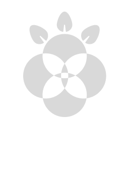
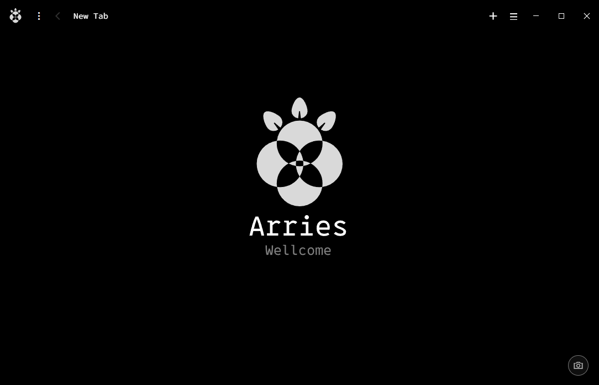
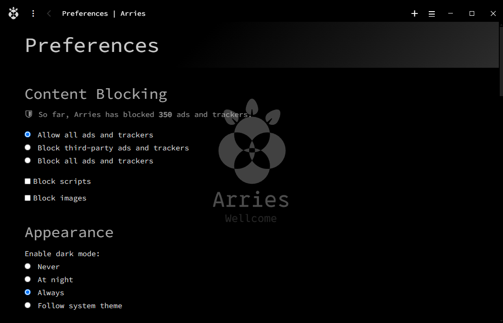
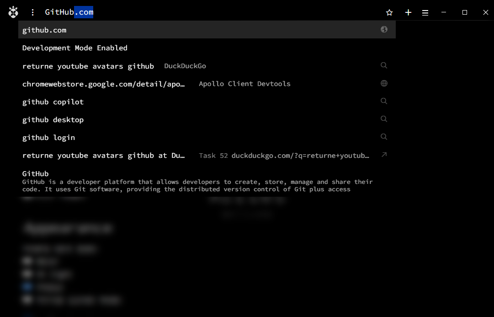
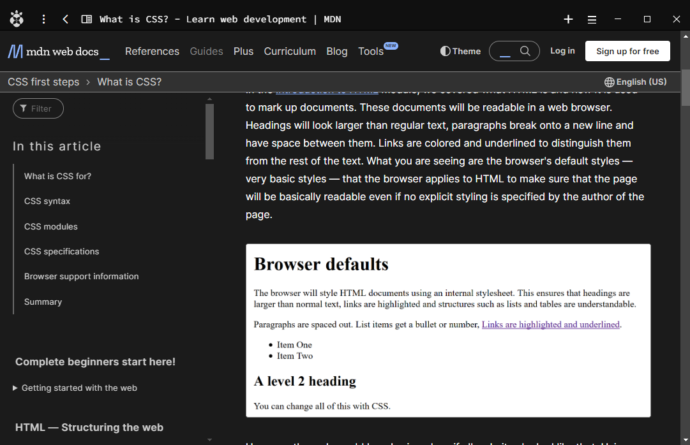

# Arries
### Arries - This is a browser based on . Arries includes greater security and performance, and an even more intuitive interface

# Extensions/Add-ons
Min and Arries themselves do not support extensions or addons, but they can be completely replaced with user scripts, for which I am writing a library to facilitate the development and transfer of extensions to user scripts

**Libraries are planned for:**
- JavaScript
- Python
- GUI
> The simplest extensions can be created through a graphical interface, something like block programming

### Screenshots

# Plans
I have plans for this project:
- Rewrite everything you can in TypeScript and Rust
- Improve security
- Disabling, Enabling and switching between user scripts, and also, in addition to the library for them, make a separate button to display their windows (like “open extension” in other browsers)
> And accordingly, add the ability to do this and embed it in user scripts, let them interact with the browser GUI
